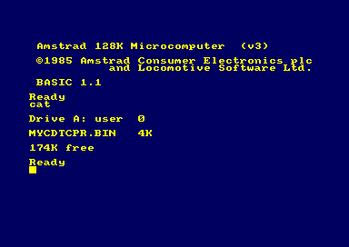
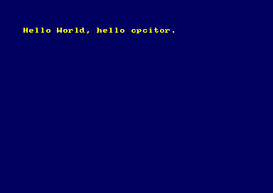

Tutorial: using cpc-dev-tool-chain with a custom project
==============================================

## Preamble

Let's name your CDTC installation location once and for all.
Adjust the line below to fit your installation.

	export MY_CDTC_ROOT=/my-path/cpc-dev-tool-chain

## Choose a location, create directory

The location below is just an example

	mkdir -p ~/my_cdtc_project
	cd ~/my_cdtc_project

## Declare it's a cdtc project

One line:

	${MY_CDTC_ROOT}/new-sdcc-project.sh .

It outputs:

    Current dir is : /home/joe/my_cdtc_project
    Proceeding with : .
    Generating new cdtc_project.conf
    Auto-generated PROJNAME=mycdtcpr
    Setting in cdtc_project.conf CDTC_ROOT=/my-path/cpc-dev-tool-chain

Optional: you can open and adjust the generated `cdtc_project.conf`.

## Create a C source

Open an editor or just copy-paste this line:

	{ echo "#include <stdio.h>" ; echo "int main() { printf(\"Hello World, hello $USER.\\n\"); while (1) {} ; return 0; }" ; } >hello.c

Let's check the result.

	cat hello.c

It should look like:

    #include <stdio.h>
    int main() { printf("Hello World, hello cpcitor.\n"); while (1) {} ; return 0; }

## Compile

Again, one line:

	make dsk

Many lines scroll, especially the first time to fetch+compile some tools.
It ends with this :

    ************************************************************************
    ************************************************************************
    **************** Current directory is: /home/joe/my_cdtc_project
    **************** Image ready: in mycdtcpr.dsk
    ************************************************************************
    **************** Fire up your favorite emulator and run from it: mycdtcpr.bin
    ************************************************************************
    ************************************************************************

## Run

Open dsk in an emulator (or transfer to real CPC as you wish).

Run program:

	run"mycdtcpr

See result:

## What now ?

* Try `make clean` to clean up the build area.
* Open and adjust the generated `cdtc_project.conf`.
* If you're curious open look at the generated files in the directory.
* Add `#include <cpcrslib.h>` to your project, start using cpcrslib.
 * Remove `#include <stdio.h>`, replace `printf()` with `cpc_PrintStr()`, see how program shrinks from 4k to 1k.
* See source code (C and ASM)
 * in `cpc-dev-tool-chain/hello_world_using_sdcc`.
 * of cpcrslib projects in `cpc-dev-tool-chain/tool/cpcrslib/cpcrslib_SDCC/examples`.
 * of cpcrslib in `cpc-dev-tool-chain/tool/cpcrslib/cpcrslib_SDCC/SDCC`.
* Change them, compile, run.
* Your imagination is the limit!
